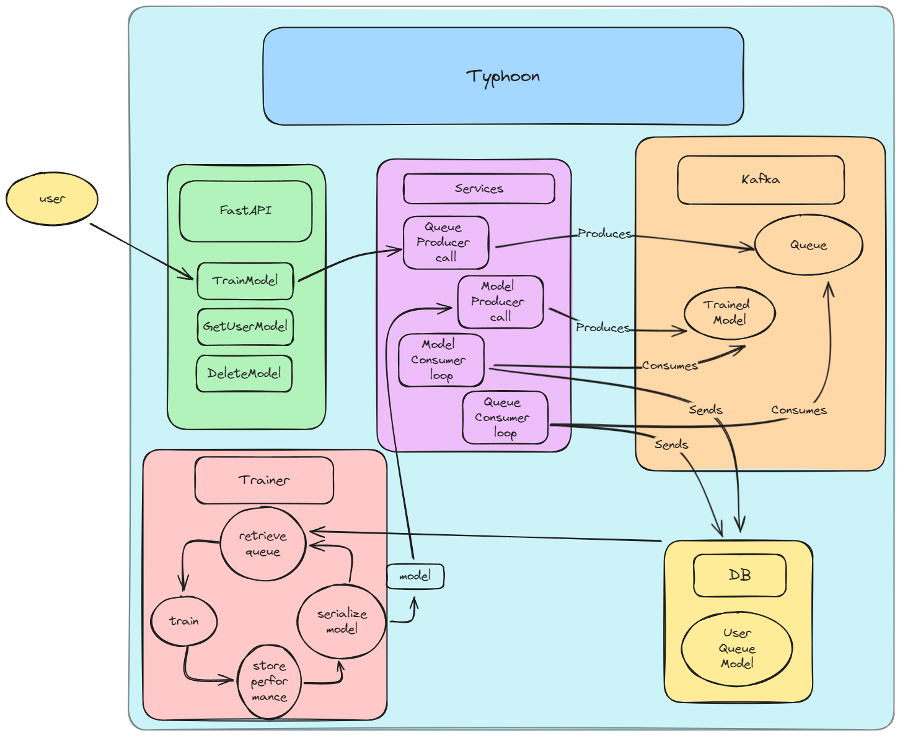

# Typhoon
[Development Log](https://trello.com/b/33zkik50/typhoon)
## Overview

Typhoon is an independent microservice that exposes an API to the user, which allows them to effectively train, retrieve and delete neural network models based on user-specified market assets.
Typhoon is meant to be integrated within my own, in development, Django platform, so it can perform algorithimic trading based on the results.

## Typhoon Workflow

## License
ATP is licensed under the MIT License. See the LICENSE file for more details.
